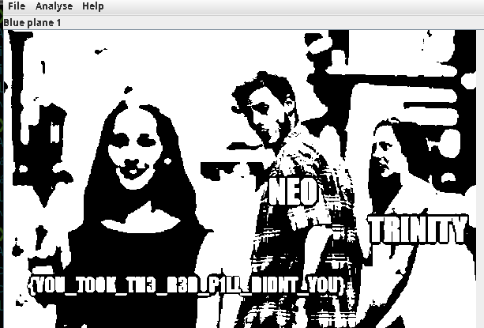

# NEO
solved 150 points
Solves: 98  Medium
Surely a love story for the ages

## Solving

Another steganography challenge, but without any hint. So we look at all the low hanging fruits...

 1. `strings` - nope
 1. `exiftools` - nada
 1. `xxd` - nein
 1. `binwalk` - nothing

Hmmm - then let`s fire up `stegsolve` - maybe something is hidden.

There it is :) 

> EZ-CTF{YOU_TOOK_TH3_R3D_P1LL_DIDNT_YOU}
