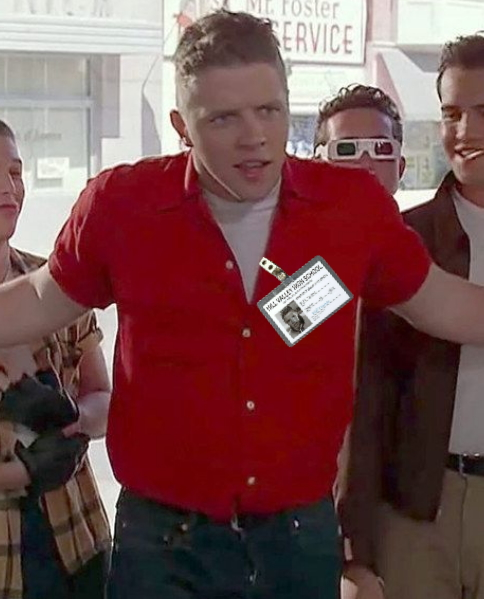

# McFly
125 points
Solves: 14  Easy
Riib_fc_I1deo_B1ff3n_Bpz_Yoo_Mdsxfkt_XoPxhatt

Flag format: EZ-CTF{D3c0d3d_Message}

## Solving

This is a fun one :) 

The hint for the challenge is this given picture

Okay what do we see here? This is Biff, the oponent of Martin McFly from the back to the future movies... a classic :D 
But something seems off in this picture... Biff does not have an ID card attached :-)

I think the cypher that was used to encrypt the message was the bif~~f~~id (bifid) cipher.

If pasted the encrypted message `Riib_fc_I1deo_B1ff3n_Bpz_Yoo_Mdsxfkt_XoPxhatt` in [CyberChef](https://gchq.github.io/CyberChef) and used the bifid cipher decode function.
The decoded message is: `This_is_B1fid_C1ph3r_Are_You_Chicken_McFlyyyy`

> EZ-CTF{This_is_B1fid_C1ph3r_Are_You_Chicken_McFlyyyy}
