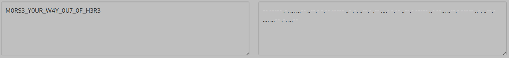

#More Sense
60 points
Solves: 123  Easy
This is too easy!
You will make more sense of it in no time!

Flag format: EZ-CTF{ALL_CAPS_MESSAGE}

## Solving

A quick look at the message and I knew I was ~~f....~~ lost. A long time I was banging my head against a wall.
Because a quick lookup (cipher identifier) just told me... 

> This is Baconian Cipher

Oh thanks... no it is not!

After some ~~googling~~ research I thought... lets change the character.. maybe it is binary or - wait...
Is it morse code?

Let's try something:

```shell
cat More\ Sense.txt| tr "B" - | tr "A" .
-- ----- .-. ... ...-- ..--.- -.-- ----- ..- .-. ..--.- .-- ....- -.-- ..--.- ----- ..- --... ..--.- ----- ..-. ..--.- .... ...-- .-. ...--
```
Okay let's send this to a [morse code - decoder](https://morsedecoder.com/). Oh lord - it is morse code :-).
. So this should be our flag:

> EZ-CTF{M0RS3_Y0UR_W4Y_0U7_0F_H3R3}
