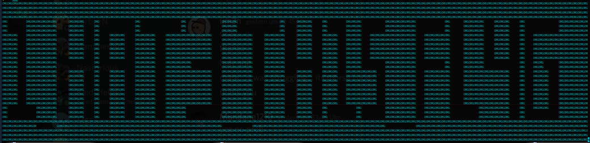

# OMG
80 points
Solves: 218  Easy
I apologize for this one
I annoyed myself creating it :)

## Solving
Just cat the file... you will the flag in kind of ascii-art.
Maybe you need to zoom out a bit.

Here is a screenshot of my console:

> EZ-CTF{1_HAT3_TH15_FL4G}
